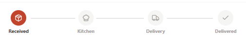

# 🍕 PizzaSlice - Pizza Delivery Platform

PizzaSlice is a full-stack pizza delivery web application I built during my **Oasis Infobyte Web Development Internship**.

It lets users browse pizzas, build their own pizza, add items to a cart, place orders, pay online through eSewa or choose Cash on Delivery, and track their orders. There is also a separate admin dashboard for managing pizzas, orders, users, inventory, and store settings.

## 📌 Features

### Customer

* Browse pizzas and view pizza details
* Browse pizzas by category
* Create a custom pizza
* Add and manage items in the cart
* Checkout with delivery details
* Email verification when creating an account
* Forgot and reset password
* Pay through eSewa
* Cash on Delivery
* View previous orders
* Track current order status
* Manage customer profile

### Admin

* Separate admin login
* Dashboard for managing the store
* Manage users
* Manage pizzas and their availability
* Manage orders and update order status
* Manage inventory
* Update stock quantities and low-stock thresholds
* Receive email alerts when stock is low

## ⚙️ How It Works

The basic order flow is:

1. Browse the menu or create a custom pizza.
2. Add the pizza to the cart.
3. Go to checkout and enter delivery details.
4. Choose eSewa or Cash on Delivery.
5. The backend creates and processes the order.
6. For eSewa, the payment is verified before the order is completed.
7. Inventory is checked and updated based on the order.
8. Admins receive and manage the order.
9. The customer can check the order status from their account.

### Order Flow



Order status moves through:

`Order Received → In Kitchen → Sent to Delivery → Delivered`

Orders can also be cancelled when applicable.

## 🔐 Authentication & Security

The application uses separate access for customers and administrators.

* JWT authentication
* Password hashing with bcrypt
* Role-based authorization
* Protected customer and admin routes
* Email verification
* Forgot-password and reset-password functionality
* Request validation with `express-validator`
* Environment variables for sensitive information
* CORS configuration

## 💳 Payment

### eSewa

eSewa is the online payment method currently integrated into the application.

The backend handles the payment flow by:

* Creating a signed payment request
* Sending the customer to eSewa
* Verifying the payment response
* Checking the transaction amount and status
* Updating the order payment status
* Deducting inventory after successful payment

### Cash on Delivery

Customers can also choose Cash on Delivery.

The order is created with a pending payment status. An admin can mark the payment as paid after the cash has been received.

## 📦 Inventory Management

PizzaSlice keeps track of the ingredients used for custom pizzas:

* Pizza bases
* Sauces
* Cheese
* Vegetables

The system checks stock before processing an order and updates the inventory when the order is placed or successfully paid, depending on the payment method.

Admins can:

* Add inventory items
* Edit inventory items
* Delete inventory items
* Update stock
* Set low-stock thresholds
* Check current inventory levels

A scheduled `node-cron` job checks the inventory daily and sends an email when an item reaches or goes below its low-stock threshold.

## 🛠️ Technology Stack

### Frontend

* **React** - Building the user interface
* **Vite** - Development and production builds
* **React Router** - Page navigation
* **Tailwind CSS** - Styling and responsive design
* **Axios** - API requests
* **React Context** - Authentication and cart state
* **Lucide React / React Icons** - Icons
* **React Hot Toast** - Notifications

### Backend

* **Node.js** - Backend runtime
* **Express.js** - REST API
* **MongoDB** - Database
* **Mongoose** - Database modelling
* **JWT** - Authentication
* **bcryptjs** - Password hashing
* **express-validator** - Request validation
* **Nodemailer** - Email services
* **node-cron** - Scheduled tasks
* **dotenv** - Environment variables
* **CORS** - Cross-origin requests

### Payment & Deployment

* **eSewa** - Online payments
* **Vercel** - Frontend hosting
* **Render** - Backend hosting
* **MongoDB Atlas** - Cloud database

## 🏗️ Application Architecture

```text
                Customer / Admin
                       |
                       v
               React + Vite Client
                       |
                 HTTP / JWT
                       |
                       v
                Express REST API
                       |
        +--------------+--------------+
        |              |              |
        v              v              v
   Authentication    Orders       Inventory
        |              |              |
        +--------------+--------------+
                       |
                       v
                Payment Services
                       |
                       v
                   MongoDB
```

The frontend handles the user interface and client-side state, while the backend handles authentication, orders, payments, inventory, emails, and database operations.

## 🚀 Deployment

The project is deployed using:

* **Frontend:** Vercel
* **Backend:** Render
* **Database:** MongoDB Atlas

The frontend connects to the deployed backend API through environment variables.

## 🎓 Internship

This project was developed as part of the **Oasis Infobyte Web Development Internship**.

While building PizzaSlice, I got practical experience working with:

* React and responsive UI development
* Node.js and Express
* REST APIs
* MongoDB and Mongoose
* Authentication and authorization
* Payment integration
* Email services
* Order and inventory management
* Admin dashboard development
* Deploying a full-stack application

Building the project helped me understand how the frontend, backend, database, authentication, payments, and deployment work together in a real application.

## 💡 About the Project

PizzaSlice started as an internship project, but I used it as an opportunity to build a complete food ordering workflow instead of just a basic frontend.

The project covers the journey from selecting a pizza to placing an order, processing payment, updating inventory, and managing the order from the admin side.

---

### Developed during the Oasis Infobyte Web Development Internship

**PizzaSlice 🍕**
